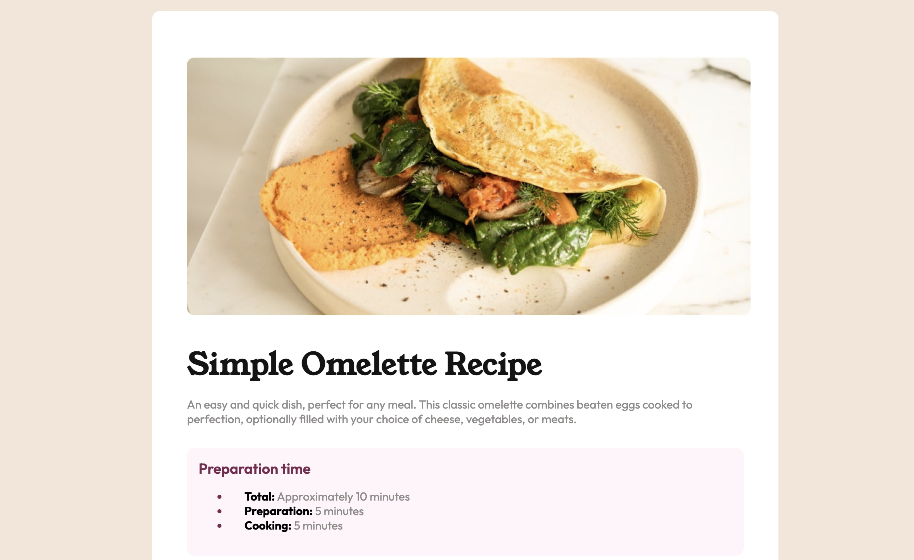

# Frontend Mentor - Recipe page solution

This is a solution to the [Recipe page challenge on Frontend Mentor](https://www.frontendmentor.io/challenges/recipe-page-KiTsR8QQKm). Frontend Mentor challenges help you improve your coding skills by building realistic projects. 

## Table of contents

- [Overview](#overview)
  - [The challenge](#the-challenge)
  - [Screenshot](#screenshot)
  - [Links](#links)
- [My process](#my-process)
  - [Built with](#built-with)
  - [What I learned](#what-i-learned)
  - [Useful resources](#useful-resources)
- [Author](#author)

**Note: Delete this note and update the table of contents based on what sections you keep.**

## Overview

### Screenshot

\\

### Links

- Solution URL: [Add solution URL here](https://your-solution-url.com)
- Live Site URL: [Add live site URL here](https://your-live-site-url.com)

## My process

### Built with

- Semantic HTML5 markup
- CSS custom properties


### What I learned


```css
table {
    width: 80%;
    padding-left: 20px;
    border-collapse: collapse;
}

td{
    padding: 15px;
    border-bottom: 1px hsl(0, 0%, 81%) solid ;
    
}
tr:last-child td {
    border-bottom: none;
}
```


### Useful resources

- [HTML Tables](https://www.w3schools.com/html/html_tables.asp) - This helped me for XYZ reason. I really liked this pattern and will use it going forward.


## Author

- Frontend Mentor - [@sarachafikidrissi](https://www.frontendmentor.io/profile/sarachafikidrissi)
- Twitter - [@SaraChafikIdri1](https://twitter.com/SaraChafikIdri1)